# Pothole Detection Project Report

## 1. Project Overview

This report documents the methodology, workflow, and results for a pothole detection benchmark using drone-relevant road imagery and YOLO-family detectors.

Primary objective:

- Identify the best accuracy-latency trade-off for deployment in near-real-time infrastructure inspection.

Reference notebook:

- `experiments/pothole-detection (10).ipynb`

Model scope in this run:

- `YOLOv8n`
- `YOLOv9c`
- `YOLOv11`
- `YOLOv12n`
- `YOLOv8-FPN`

Important note on YOLO-NAS:

- YOLO-NAS was excluded from this Kaggle run due to environment/dependency issues.
- Planned follow-up: separate notebook pinned to Python 3.10, then merge YOLO-NAS results into the final comparison table.

## 2. Methodology

### 2.1 Problem framing

The task is single-class object detection (`pothole`) using aerial/road images. The operational requirement is not only high mAP, but high mAP under strict latency constraints for practical edge/cloud inference.

### 2.2 Dataset and annotation format

The training pipeline uses YOLO-format datasets with split directories:

- `train/images`, `train/labels`
- `valid/images`, `valid/labels`
- `test/images`, `test/labels`

YOLO label row schema:

- `class_id x_center y_center width height`
- all coordinates are normalized to `[0, 1]` relative to image width/height.

### 2.3 Data schema used in analysis outputs

The notebook generates structured CSV outputs.

`final_research_results.csv`

- `Model`, `mAP50`, `mAP50-95`, `Parameters`, `Latency_ms`, `FPS`

`engineering_benchmark_scenarios.csv`

- `Model`, `Scenario`, `Image_Size`, `Runs`, `Device`, `Weights`
- `Latency_ms_mean`, `Latency_ms_p50`, `Latency_ms_p95`, `Latency_ms_std`, `FPS`

`qualitative_model_summary.csv`

- `Model`, `Conf`, `Images`, `GT_Objects`, `Pred_Objects`, `TP`, `FP`, `FN`
- `Precision`, `Recall`, `F1`

### 2.4 Architectures benchmarked

`YOLOv8n`: baseline compact detector with strong speed/accuracy balance.

`YOLOv9c`: larger model variant with stronger representational capacity; expected mAP gains with latency cost.

`YOLOv11`: efficient modern YOLO variant targeting practical deployment speed.

`YOLOv12n`: newer compact model expected to preserve accuracy with moderate inference cost.

`YOLOv8-FPN`: custom neck simplification favoring speed over localization quality.

## 3. End-to-End Workflow

### 3.1 Numbered workflow

1. Environment setup and dataset loading.
2. EDA and dataset integrity checks.
3. Ultralytics model training (checkpoint-aware resume).
4. Training status verification from run artifacts.
5. Optional FPN-only fine-tuning sweep.
6. Artifact export (`.pt`, `.onnx`, `.yaml`) and index generation.
7. Qualitative testing over confidence thresholds.
8. Engineering benchmarking across image-size scenarios.
9. Final visualization, ranking, and report export.

### 3.2 Mermaid workflow

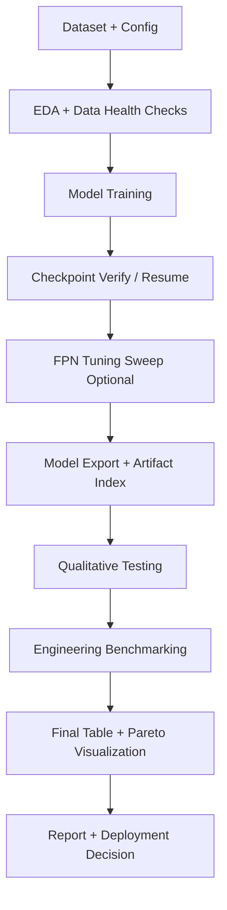

## 4. Core Formulas and Metrics

IoU (Intersection over Union):
$$
IoU = \frac{|B_{pred} \cap B_{gt}|}{|B_{pred} \cup B_{gt}|}
$$

Precision:
$$
Precision = \frac{TP}{TP + FP}
$$

Recall:
$$
Recall = \frac{TP}{TP + FN}
$$

F1-score:
$$
F1 = \frac{2 \cdot Precision \cdot Recall}{Precision + Recall}
$$

Frame rate:
$$
FPS = \frac{1000}{Latency_{ms}}
$$

mAP metrics:

- `mAP50`: AP at IoU threshold `0.50`
- `mAP50-95`: AP averaged from IoU `0.50` to `0.95`

## 5. EDA Summary

From notebook EDA outputs:

- Total annotations analyzed: `22,603`
- Training images: `6,091` (annotated: `6,087`)
- Validation images: `2,094`
- Test images: `1,055`
- Average boxes/image: approximately `2.5` across all splits.

Bounding-box summary:

- Mean normalized width: `0.228`
- Mean normalized height: `0.157`
- Mean normalized area: `0.0609`
- Median normalized area: `0.0161`

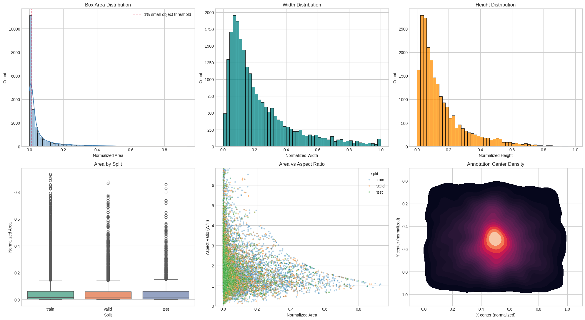
This plot captures the label geometry distribution. The key takeaway is the long-tail area profile: the dataset has many small to medium potholes and fewer very large ones, which motivates using architectures and augmentations that preserve small-object sensitivity.

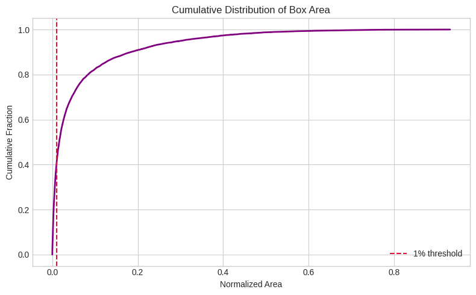
This figure highlights variation across annotation geometry and split behavior. The spread supports the decision to benchmark multiple architectures rather than optimize a single model early.

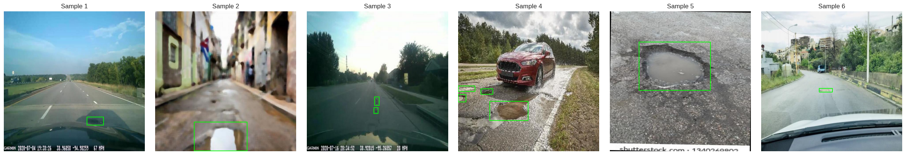
The qualitative sample overlays confirm annotation quality and variability in road texture, lighting, and pothole shape. This supports the later use of confidence-threshold sweeps in evaluation.

## 6. Training and Evaluation Results

### 6.1 Final comparison table

| Model | mAP50 | mAP50-95 | Parameters (M) | Latency (ms) | FPS |
| --- | ---: | ---: | ---: | ---: | ---: |
| YOLOv8n | 0.7821 | 0.4649 | 3.0058 | 6.9098 | 144.72 |
| YOLOv9c | 0.7921 | 0.4846 | 25.3200 | 36.2758 | 27.57 |
| YOLOv11 | 0.7789 | 0.4596 | 2.5823 | 9.3494 | 106.96 |
| YOLOv12n | 0.7848 | 0.4631 | 2.5569 | 13.8610 | 72.14 |
| YOLOv8-FPN | 0.7066 | 0.3960 | 2.2058 | 6.4183 | 155.80 |

Key outcomes:

- Best accuracy: `YOLOv9c`
- Fastest inference: `YOLOv8-FPN`
- Best real-time quality compromise in this run: `YOLOv12n`

### 6.2 Final Pareto figure

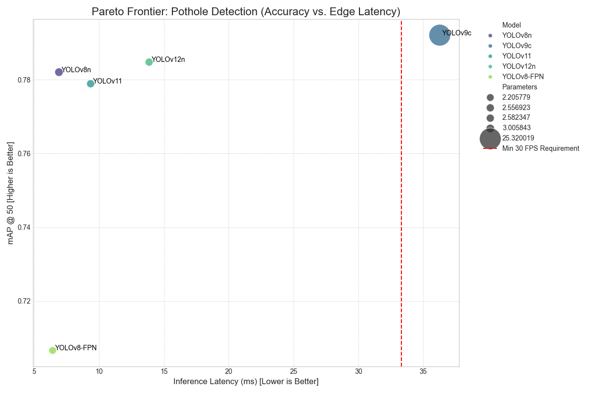
This chart shows the central trade-off: YOLOv9c dominates in accuracy but sits outside a strict 30 FPS constraint, while YOLOv8-FPN dominates speed but with a clear accuracy penalty. YOLOv12n and YOLOv8n are on a more practical deployment boundary for real-time use.

## 7. Qualitative Testing Workflow and Results

### 7.1 Workflow (numbered)

1. Sample test images from the held-out split.
2. Run inference for each model at confidence thresholds (`0.25`, `0.50`, `0.70`).
3. Convert predictions and labels to comparable box format.
4. Perform IoU-based greedy matching to compute `TP`, `FP`, `FN`.
5. Aggregate per-image and per-model metrics (`Precision`, `Recall`, `F1`).
6. Export per-image and summary CSV files.
7. Plot confidence/model comparison and distribution views.

### 7.2 Workflow (Mermaid)

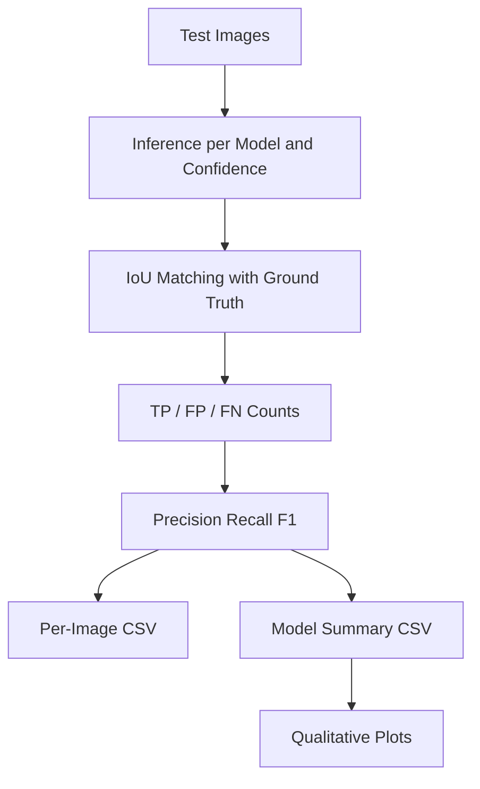

### 7.3 Formula-level explanation

For each image and model-threshold pair:

- boxes are matched when `IoU >= 0.5`
- unmatched prediction boxes contribute to `FP`
- unmatched ground-truth boxes contribute to `FN`

Using:
$$
Precision = \frac{TP}{TP + FP},\quad
Recall = \frac{TP}{TP + FN},\quad
F1 = \frac{2PR}{P+R}
$$

### 7.4 Qualitative result interpretation

- At `conf=0.25`, `YOLOv11` achieved the best F1 balance.
- At higher confidence thresholds (`0.50`, `0.70`), `YOLOv9c` remained strongest.
- `YOLOv8-FPN` stayed speed-favored but trailed in F1.

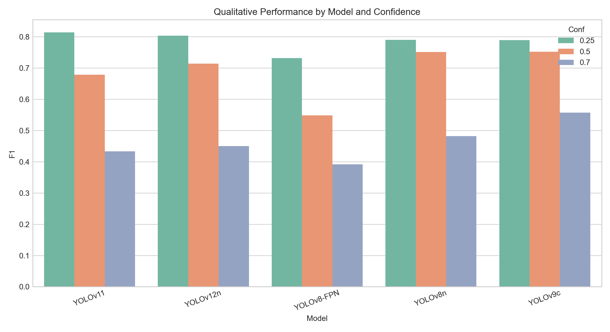
This bar plot compares mean F1 across confidence levels. It shows confidence sensitivity by architecture and highlights where each model performs best.

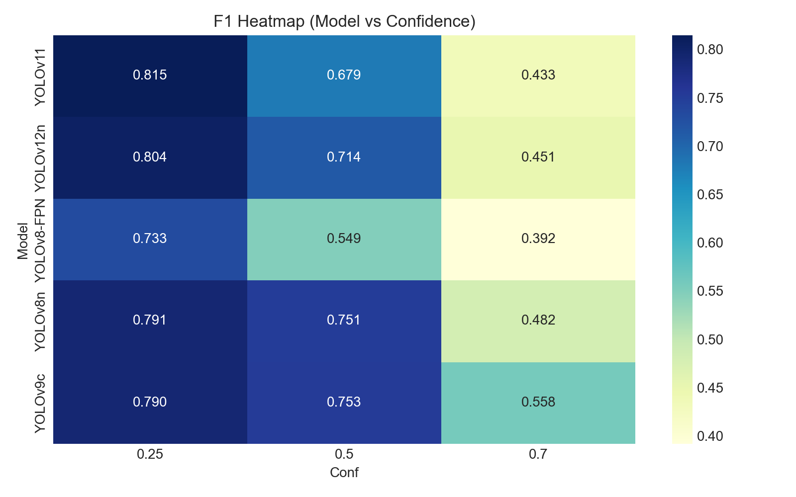
The heatmap makes model-threshold interactions easier to compare. It is useful for selecting operating thresholds for deployment profiles.

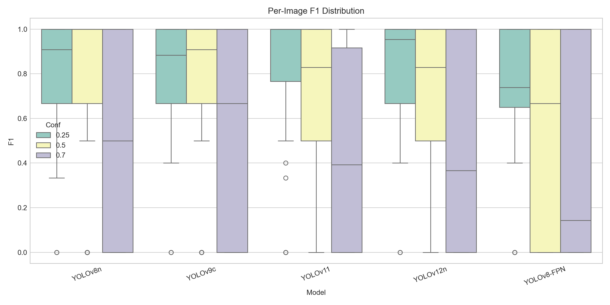
Distribution spread reveals stability: narrower, higher distributions are preferable for consistent field performance rather than isolated high scores.

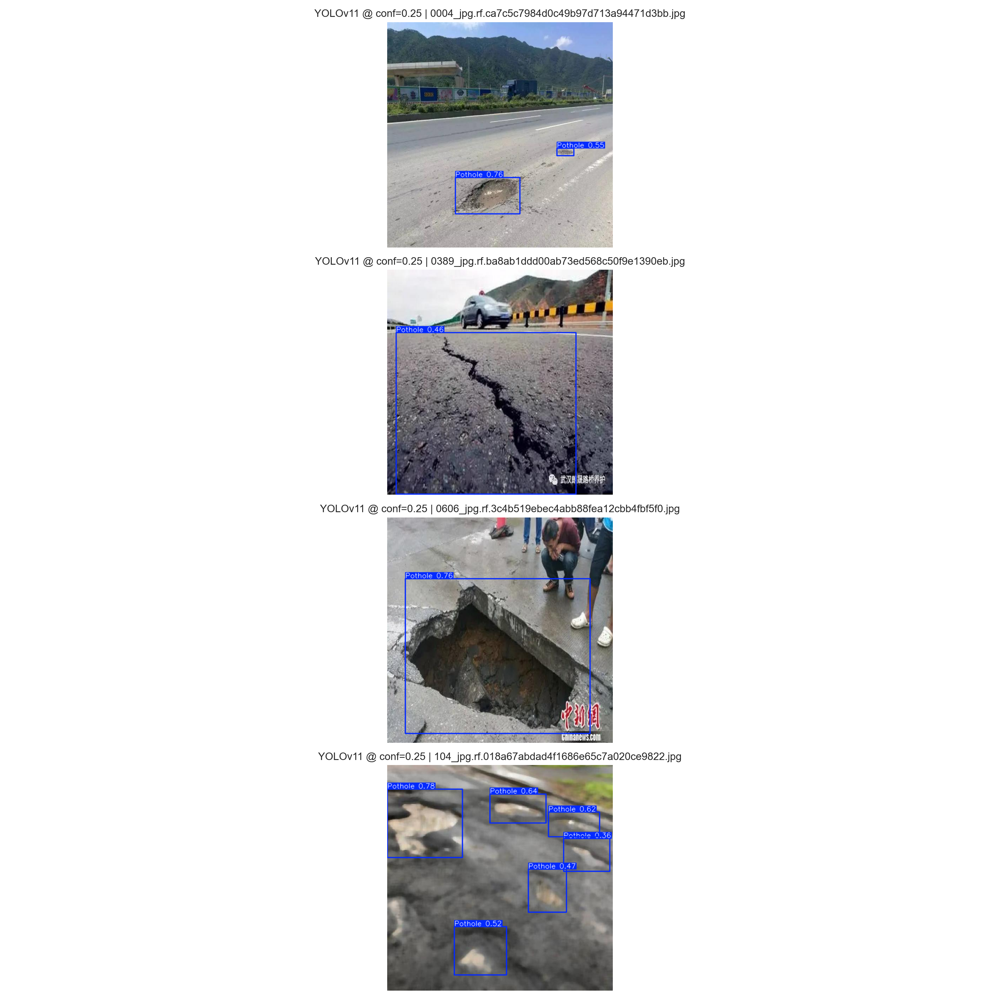
This qualitative panel provides direct visual confidence in detection behavior and failure modes, complementing numeric metrics.

## 8. Engineering Benchmarking Workflow and Results

### 8.1 Workflow (numbered)

1. Load each trained checkpoint.
2. Define scenario set by image size (`320`, `640`, `960`).
3. Run warmup passes to stabilize runtime.
4. Run timed inference loops (`runs=80`) per scenario.
5. Compute `mean`, `p50`, `p95`, `std`, and `FPS`.
6. Export scenario and aggregated benchmark CSVs.
7. Produce trend, heatmap, and baseline p95 plots.

### 8.2 Workflow (Mermaid)

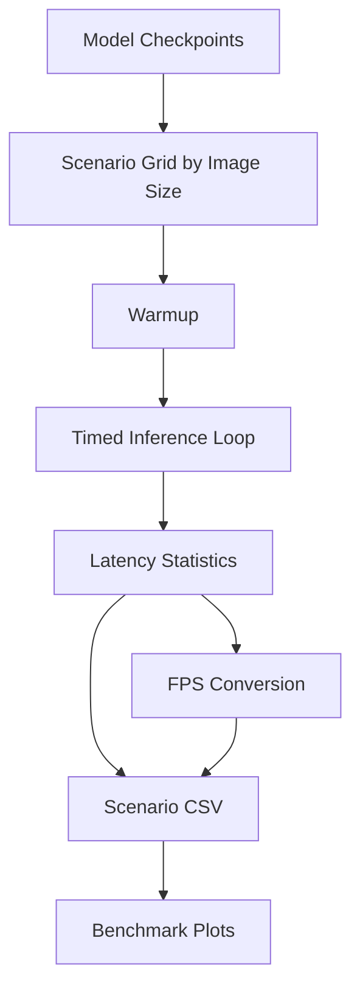

### 8.3 Benchmark formula and interpretation

Primary runtime transformation:
$$
FPS = \frac{1000}{Latency_{ms,mean}}
$$

`p95` latency is emphasized for deployment because mean latency alone can hide jitter. Lower `p95` and lower `std` generally indicate a more stable runtime profile.

At `imgsz=640`:

- YOLOv8n: `6.91 ms`, `144.72 FPS`
- YOLOv9c: `36.28 ms`, `27.57 FPS`
- YOLOv11: `9.35 ms`, `106.96 FPS`
- YOLOv12n: `13.86 ms`, `72.14 FPS`
- YOLOv8-FPN: `6.42 ms`, `155.80 FPS`

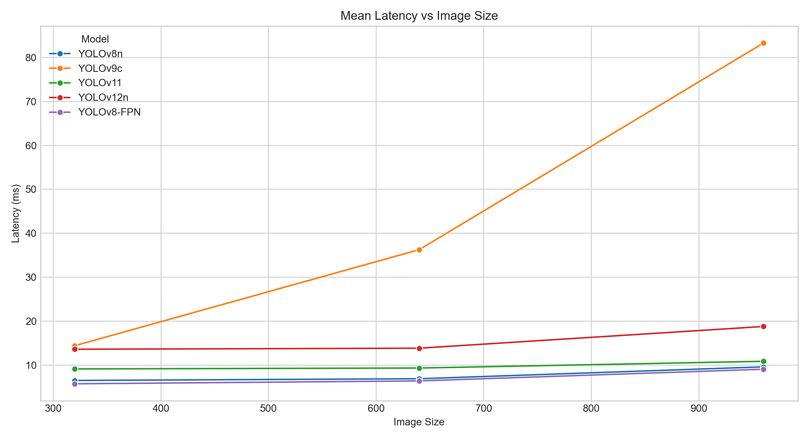
This trend chart shows scale sensitivity. As image size increases, latency rises non-linearly depending on architecture complexity.

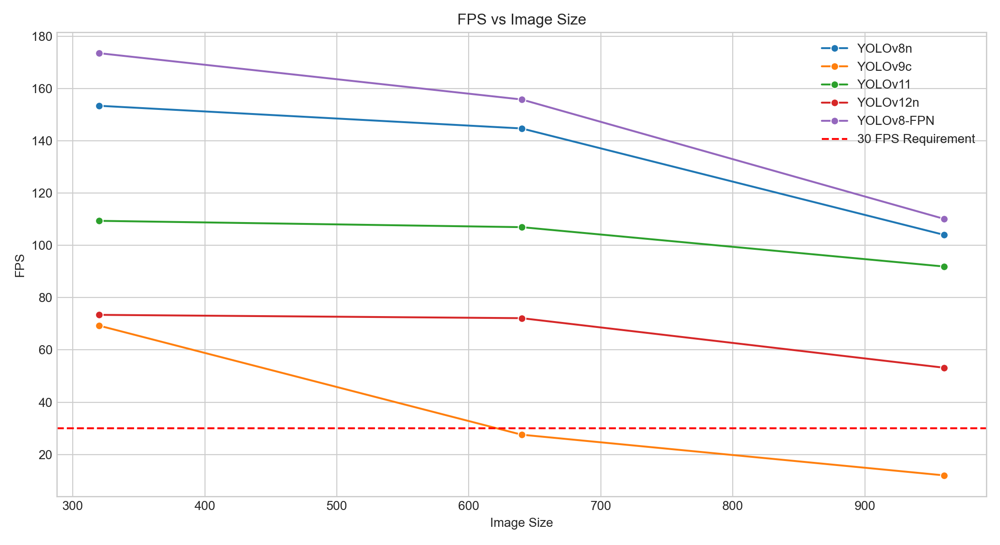
This chart translates latency into deployment-friendly throughput and directly shows which models remain above the 30 FPS requirement.

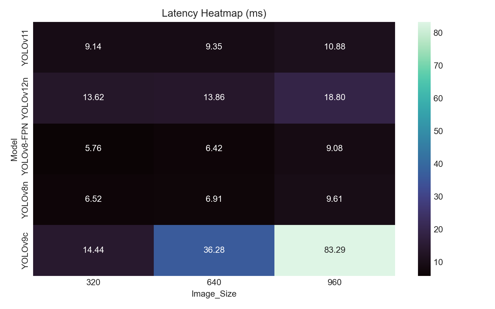
The heatmap gives a compact scenario-level comparison and makes cross-model runtime ranking immediate.

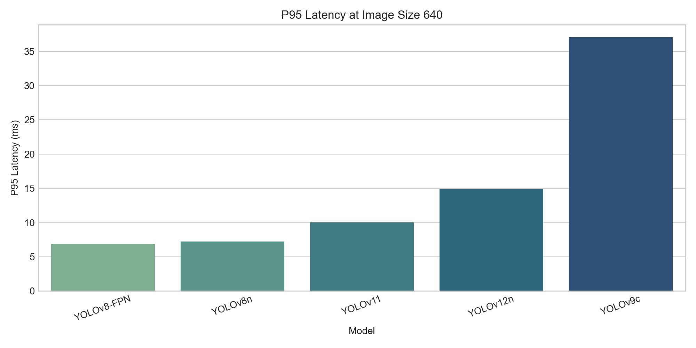
The p95 chart highlights worst-case behavior at baseline settings, which is critical for real-time reliability.

## 9. YOLO-NAS Integration Section Template

This section is intentionally structured as a drop-in template for the upcoming Python 3.10 YOLO-NAS notebook output.

### 9.1 Planned workflow

1. Train YOLO-NAS under pinned Python 3.10 environment.
2. Validate on the same dataset split and image size settings used in this report.
3. Run qualitative and engineering benchmark pipelines with matching configurations.
4. Append YOLO-NAS records to existing CSV tables.
5. Regenerate final comparison plots and update recommendation.

### 9.2 Required fields to collect

- `mAP50`
- `mAP50-95`
- `Parameters`
- `Latency_ms` at `imgsz=640`
- `FPS` at `imgsz=640`
- scenario latency stats (`mean`, `p50`, `p95`, `std`) across image sizes
- qualitative summary (`Precision`, `Recall`, `F1`) by confidence threshold

### 9.3 Insert table template

| Model | mAP50 | mAP50-95 | Parameters (M) | Latency (ms) | FPS | Status |
| --- | ---: | ---: | ---: | ---: | ---: | --- |
| YOLO-NAS-S | TBD | TBD | TBD | TBD | TBD | Pending Python 3.10 run |

### 9.4 Merge checklist

1. Append YOLO-NAS rows to `final_research_results.csv`.
2. Append scenario rows to `engineering_benchmark_scenarios.csv`.
3. Append qualitative rows to `qualitative_model_summary.csv`.
4. Re-render benchmark and qualitative plots.
5. Recompute best-accuracy and best-real-time conclusions.

## 10. Architecture-level Findings

`YOLOv9c`:

- Best detector quality in this run.
- Latency too high for strict real-time edge budget at 640.

`YOLOv12n`:

- Best practical compromise for real-time operation among high-accuracy models.

`YOLOv8n` / `YOLOv11`:

- Strong balanced candidates with high throughput.

`YOLOv8-FPN`:

- Confirmed speed gain, but mAP drop is significant.
- Requires additional tuning if selected for production.

## 11. Current Deployment Recommendation

If deployment must proceed before YOLO-NAS integration:

- Primary candidate: `YOLOv12n`
- Secondary fallback: `YOLOv8n`
- High-accuracy offline option: `YOLOv9c`

## 12. Reproducibility Notes

- Run artifacts and report tables are exported under `results/`.
- Deployment API model registry is configured in `deployment/model_config.yaml`.
- Resume-capable training and mixed-path checkpoint discovery are integrated in the notebook workflow.
