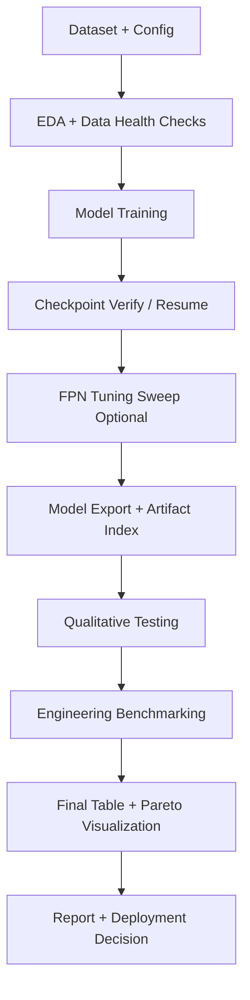
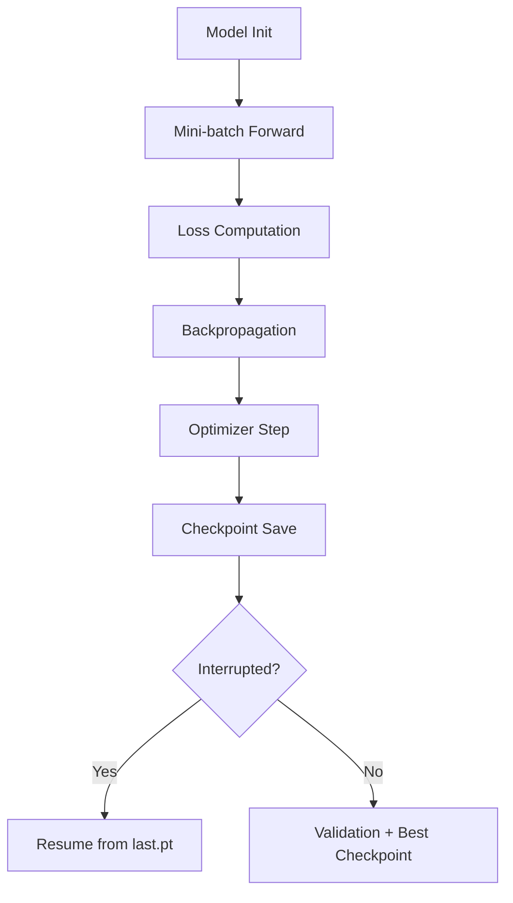
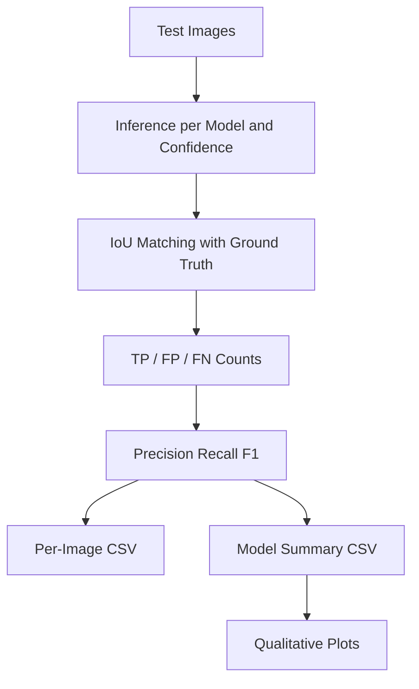
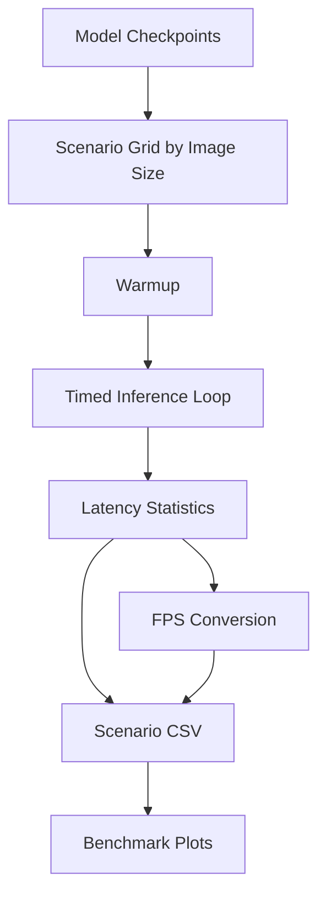

# Technical Methodology: DETECTION AND LOCALIZATION OF POTHOLES ON ROAD USING DRONE IMAGES

Author: EngJamesO
Date: February 17th 2026

## **Executive Summary**

This document outlines the experimental design for benchmarking five distinct object detection architectures—YOLOv8, YOLOv9, YOLOv12, YOLO-FPN, and YOLO-NAS—for the specific task of detecting road anomalies (potholes) from aerial imagery. The primary objective is not merely maximising precision, but identifying the "Pareto frontier" between inference latency (ms) and detection accuracy (mAP) typically suitable for deployment on embedded edge devices (e.g., NVIDIA Jetson Orin NX) aboard UAVs. This report documents the methodology, workflow, and results for a pothole detection benchmark using drone-relevant road imagery and YOLO-family detectors.

Primary objective:

- Identify the best accuracy-latency trade-off for deployment in near-real-time infrastructure inspection.

Reference notebook:

- `experiments/pothole-detection (10).ipynb`

Model scope in this run:

- `YOLOv8n`
- `YOLOv9c`
- `YOLOv11`
- `YOLOv12n`
- `YOLOv8-FPN`

Important note on YOLO-NAS:

- YOLO-NAS was excluded from this Kaggle run due to environment/dependency issues.
- Planned follow-up: separate notebook pinned to Python 3.10, then merge YOLO-NAS results into the final comparison table.

## **3. Methodology**

### **3.1 Problem framing**

The task is single-class object detection (`pothole`) using aerial/road images. The operational requirement is not only high mAP, but high mAP under latency constraints for practical edge/cloud inference.

### **3.2 Dataset composition** - validation not implemented

We utilise a dual-source strategy to ensure model robustness. The training set focuses on learning high-level features, while the validation set tests generalisation against unseen road textures.

| Dataset Source | Role | Size (Images) | Key Characteristics | Selection Rationale |
| :---- | :---- | :---- | :---- | :---- |
| Smartathon (Roboflow) | Training | \~9,200 | High Resolution Nadir & Oblique angles  Varied lighting (shadows) | The "top-down" perspective closely mimics the orthomosaic imagery generated by drone mapping missions. |
| Kaggle (YOLOv11 Optimized) | Validation | \~3,900 | Clean annotations Diverse asphalt types Wet/Dry conditions | Acts as an out-of-sample test to ensure the model isn't overfitting to specific camera sensors or road colours. |

1. Primary Training Data: Smartathon New Pothole Detection (Roboflow). Volume: \~9,200 images  
   Rationale: This dataset offers high-resolution imagery with a mix of viewing angles. Crucially, it contains a subset of "top-down" (nadir) or high-angle oblique shots, which more closely resemble drone orthomosaics than standard automotive dashcam datasets.

2. Validation/Test Data: Pothole Detection Dataset (Kaggle \- YOLOv11 Optimised). Volume: \~3,900 images.  
   Rationale: We use this distinct dataset for out-of-sample validation to test the model's generalisation capability across different asphalt textures and lighting conditions (e.g., wet vs. dry roads), which is critical for unbiased evaluation.

### **3.3 Exploratory Data Analysis**

From notebook EDA outputs:

- Total annotations analyzed: `22,603`
- Training images: `6,091` (annotated: `6,087`)
- Validation images: `2,094`
- Test images: `1,055`
- Average boxes/image: approximately `2.5` across all splits.

Bounding-box summary:

- Mean normalized width: `0.228`
- Mean normalized height: `0.157`
- Mean normalized area: `0.0609`
- Median normalized area: `0.0161`

This plot captures the label geometry distribution. The key takeaway is the long-tail area profile: the dataset has many small to medium potholes and fewer very large ones, which motivates using architectures and augmentations that preserve small-object sensitivity.

This figure highlights variation across annotation geometry and split behavior. The spread supports the decision to benchmark multiple architectures rather than optimize a single model early.

The qualitative sample overlays confirm annotation quality and variability in road texture, lighting, and pothole shape. This supports the later use of confidence-threshold sweeps in evaluation.

### **3.4 Pre-processing Strategy** - verify

1. Mosaic Augmentation: Essential for pothole detection. Potholes are often small relative to the frame. Mosaic (combining 4 images) forces the model to learn context-independent features rather than relying on global scene context, improving small object detection.  
2. Resolution: We standardise input size to 640x640. While 1280x1280 is preferable for high-altitude small object detection, 640 is the upper limit for maintaining real-time (\>30 FPS) inference on current edge hardware.

### **3.5 Dataset and annotation format** - add example for the YOLO label row

The training pipeline uses YOLO-format datasets with split directories:

- `train/images`, `train/labels`
- `valid/images`, `valid/labels`
- `test/images`, `test/labels`

YOLO label row schema:

- `class_id x_center y_center width height`
- all coordinates are normalized to `[0, 1]` relative to image width/height.

### **3.6 Data schema used in analysis outputs** - consider removing

The notebook generates structured CSV outputs.

`final_research_results.csv`

- `Model`, `mAP50`, `mAP50-95`, `Parameters`, `Latency_ms`, `FPS`

`engineering_benchmark_scenarios.csv`

- `Model`, `Scenario`, `Image_Size`, `Runs`, `Device`, `Weights`
- `Latency_ms_mean`, `Latency_ms_p50`, `Latency_ms_p95`, `Latency_ms_std`, `FPS`

`qualitative_model_summary.csv`

- `Model`, `Conf`, `Images`, `GT_Objects`, `Pred_Objects`, `TP`, `FP`, `FN`
- `Precision`, `Recall`, `F1`

### **3.7 Model Architectures & Selection Rationale**

Among the top pothole detection architectures, the following commonly appear: YOLO, YOLO-NAS, and YOLO-FPN. We selected five architectures to represent the evolution of the YOLO family of computer vision models, specifically targeting the trade-off between architectural complexity and speed.

1. `YOLOv8n`: baseline compact detector with strong speed/accuracy balance.
2. `YOLOv9c`: larger model variant with stronger representational capacity; expected mAP gains with latency cost.
3. `YOLOv11`: efficient modern YOLO variant targeting practical deployment speed.
4. `YOLOv12n`: newer compact model expected to preserve accuracy with moderate inference cost.
5. `YOLOv8-FPN`: custom neck simplification favoring speed over localization quality.

#### YOLOv8 (Baseline)**

YOLOv8 introduced the C2f (Cross Stage Partial bottleneck with two convolutions) module, replacing the older C3 module. It utilises an anchor-free detection head, which decouples the classification and regression tasks.

Relevance: It serves as the control variable. Any improvements in v9 or v12 must be statistically significant against this baseline to justify the added complexity.

#### YOLOv9 (Programmable Gradient Information)**

Deep neural networks often suffer from the "Information Bottleneck" problem, where feature data is lost as it passes through successive downsampling layers.

Innovation: YOLOv9 introduces Programmable Gradient Information (PGI) and the Generalised Efficient Layer Aggregation Network (GELAN). PGI provides an auxiliary supervision branch that ensures gradients reliably propagate back to shallow layers.

Relevance: Potholes are small, texture-poor objects. By preventing information loss in deep layers, v9 should theoretically maintain higher recall for small defects that v8 might compress away.

#### YOLOv12 (Attention-centric)**

Released in early 2025, YOLOv12 shifts away from pure CNNs to an Attention-Centric design without the extreme computational cost of Transformers. It uses Area Attention, which divides feature maps into regions to capture global context, and R-ELAN for the backbone.

It is considered because potholes are often confused with shadows, oil stains, or patches. Convolutional networks look at local features (edges), but Attention mechanisms look at context. v12 should be superior at reducing False Positives (e.g., classifying a shadow as a pothole).

#### YOLO-FPN (Latency Optimisation)** - draw architecture diagram highlighting fpn

Standard YOLOv8 uses PANet (Path Aggregation Network), which has both a top-down path (semantics) and a bottom-up path (localisation). We modify the architecture by replacing the standard Path Aggregation Network (PANet) neck with a classic FPN (Feature Pyramid Network), effectively removing the extra bottom-up path.

PANet adds a "bottom-up" path to augment localisation features, but this adds significant computational cost (FLOPs). By reverting to a simpler FPN, we hypothesise a 15-20% gain in inference speed with only a marginal drop in localisation accuracy.

Expected practical effects of this modification include:

- Fewer feature aggregation operations compared with heavier bi-directional necks.
- Lower computational load (FLOPs proxy), improving latency and FPS.
- Slightly weaker fine localization/feature re-aggregation, which can reduce detection quality on hard cases.

Trade-off expected from design:

- Speed gains, especially on constrained hardware.
- Potential drop in `mAP50-95` due to less expressive feature fusion.

Conceptually:

1. Backbone extracts hierarchical features (`P3`, `P4`, `P5`).
2. FPN top-down path upsamples high-level semantics and merges with lower-level maps.
3. Detection head predicts boxes/classes from fused multi-scale features.

#### YOLO-NAS (Neural Architecture Search)**

Developed by Deci AI, this architecture was not designed by humans but discovered via AutoNAC (Automated Neural Architecture Construction), specifically to minimise latency on GPU architecture. The architecture is explicitly found by searching for the best layout that maximises accuracy under a specific latency budget on NVIDIA hardware. This model targets the "efficiency gap." It uses quantisation-aware blocks (QARepVGG), making it the strongest candidate for eventual deployment on INT8 precision hardware (TensorRT).

This is the "production-ready" candidate. Its blocks are designed to lose minimal accuracy when converted to INT8 precision, making it ideal for the limited power budget of a drone.

#### Model Comparison Matrix**

| Model | Core Innovation | Backbone / Neck | Hypothesis for Pothole Detection |
| :---- | :---- | :---- | :---- |
| **YOLOv8** | Anchor-Free / C2f | CSPDarknet / PANet | **The Baseline.** Provides the standard performance benchmark for speed vs. accuracy. |
| **YOLOv9** | PGI & GELAN | GELAN / PANet \+ PGI | **Small Object Specialist.** PGI retains gradient info lost in deep layers, critical for small potholes. |
| **YOLOv12** | Area Attention | R-ELAN / Attention | **Texture discriminator.** Attention mechanisms should better distinguish wet spots from potholes. |
| **YOLO-FPN** | Neck Simplification | CSPDarknet / **FPN** | **Speed Specialist.** Removing the bottom-up PANet path reduces FLOPs for higher flight speeds. |
| **YOLO-NAS** | Architecture Search | QARepVGG / NAS-FPN | **Hardware Specialist.** Optimised specifically for INT8 quantisation on GPU tensor cores. |

### **3.8 ML Workflow** - add short paragraph before listing workflow steps

1. Environment setup and dataset loading.
2. EDA and dataset integrity checks.
3. Ultralytics model training (checkpoint-aware resume).
4. Training status verification from run artifacts.
5. Optional FPN-only fine-tuning sweep.
6. Artifact export (`.pt`, `.onnx`, `.yaml`) and index generation.
7. Qualitative testing over confidence thresholds.
8. Engineering benchmarking across image-size scenarios.
9. Final visualization, ranking, and report export.

#### Model Training workflow

1. Initialize model weights/config (`.pt` pretrained or custom YAML build).
2. Train on YOLO-format splits with fixed `imgsz=640` and configured batch size.
3. Apply data augmentation (mosaic/mixup/scale/translation) from training config.
4. Save checkpoints per run (`last.pt`, `best.pt`, `results.csv`).
5. Resume interrupted runs from `last.pt` using checkpoint-aware logic.
6. Validate on `val` split and store mAP metrics.

#### Optimization objective and loss composition - fix formula formatting

Object detection training optimizes a composite loss:
$$
\mathcal{L}_{total} = \lambda_{box}\mathcal{L}_{box} + \lambda_{cls}\mathcal{L}_{cls} + \lambda_{dfl}\mathcal{L}_{dfl}
$$
where:

- \(\mathcal{L}_{box}\): box regression loss (localization quality)
- \(\mathcal{L}_{cls}\): classification loss
- \(\mathcal{L}_{dfl}\): distribution focal loss term used in modern YOLO heads
- \(\lambda\) terms: weighting coefficients

Parameter update step:
$$
\theta_{t+1} = \theta_t - \eta \nabla_{\theta} \mathcal{L}_{total}
$$
with learning rate \(\eta\) and optimizer-defined update dynamics.

### **3.9 Evaluation metrics**

For evaluation, we combine engineering constraints such as FLOPs with traditional academic metrics.

1. mAP @ 50-95: The standard for bounding box precision.  
2. Inference Latency (ms)  
3. FLOPs (Floating Point Operations): A proxy for power consumption. Higher FLOPs \= higher GPU wattage \= reduced flight time.  
4. Recall (False Negative Rate): In self driving behicles applications, missing a pothole (False Negative) is worse than flagging a shadow as a pothole (False Positive), as the latter can be filtered by human review.

| Metric | Unit | Definition & Relevance |
| :---- | :---- | :---- |
| **mAP @ 50-95** | % | **Mean Average Precision.** The standard academic measure of detection quality averaged over IoU thresholds from 0.5 to 0.95. |
| **Inference Latency** | ms | **Time-to-Action.** The time elapsed between inputting an image tensor and receiving bounding box coordinates. Critical for real-time flight control. |
| **Throughput** | FPS | **Frames Per Second.** 1000 / Latency. A minimum of 30 FPS is required to ensure overlap redundancy in aerial mapping. |
| **FLOPs** | G | **Floating Point Operations.** A proxy for computational complexity and battery drain on the drone. |
| **Small Object Recall** | % | Specific recall metric for bounding boxes smaller than 32x32 pixels (COCO definition). This is the true test for high-altitude pothole detection. |

#### Detection quality metrics

IoU (Intersection over Union):
$$
IoU = \frac{|B_{pred} \cap B_{gt}|}{|B_{pred} \cup B_{gt}|}
$$

Precision:
$$
Precision = \frac{TP}{TP + FP}
$$
Precision indicates how many predicted potholes are truly potholes. High precision reduces false alarms.

Recall:
$$
Recall = \frac{TP}{TP + FN}
$$
Recall indicates how many actual potholes are detected. In road safety workflows, recall is critical because false negatives (missed potholes) are operationally costly.

F1-score:
$$
F1 = \frac{2 \cdot Precision \cdot Recall}{Precision + Recall}
$$
F1 balances precision and recall when both matter.

mAP metrics:

- `mAP50`: AP at IoU threshold `0.50`.
- `mAP50-95`: AP averaged from IoU `0.50` to `0.95` (stricter localization quality indicator).

#### Runtime metrics

Frame rate:
$$
FPS = \frac{1000}{Latency_{ms}}
$$

Latency summary statistics used in benchmarking:

- `mean`: average latency across runs.
- `p50`: median latency (typical-case runtime).
- `p95`: 95th percentile latency (near worst-case runtime).
- `std`: standard deviation of latency (jitter/stability).

Interpretation of key runtime values:

- Low `mean` with high `p95` suggests occasional spikes.
- Low `std` indicates stable inference timing.
- For real-time systems, `p95` is usually more actionable than mean alone.

## **4. Results and Discussion**

The evaluation phase is divided into:

1. Pareto
2. Qualitative testing
3. Benchmarking

### 4.1 Model comparison table - add short paragraph explaining how this was obtained

| Model | mAP50 | mAP50-95 | Parameters (M) | Latency (ms) | FPS |
| --- | ---: | ---: | ---: | ---: | ---: |
| YOLOv8n | 0.7821 | 0.4649 | 3.0058 | 6.9098 | 144.72 |
| YOLOv9c | 0.7921 | 0.4846 | 25.3200 | 36.2758 | 27.57 |
| YOLOv11 | 0.7789 | 0.4596 | 2.5823 | 9.3494 | 106.96 |
| YOLOv12n | 0.7848 | 0.4631 | 2.5569 | 13.8610 | 72.14 |
| YOLOv8-FPN | 0.7066 | 0.3960 | 2.2058 | 6.4183 | 155.80 |

Key outcomes:

- Best accuracy: `YOLOv9c`
- Fastest inference: `YOLOv8-FPN`
- Best real-time quality compromise in this run: `YOLOv12n`

### 4.2 Final Pareto figure

This chart shows the central trade-off: YOLOv9c dominates in accuracy but sits outside a strict 30 FPS constraint, while YOLOv8-FPN dominates speed but with a clear accuracy penalty. YOLOv12n and YOLOv8n are on a more practical deployment boundary for real-time use.

### 4.3 Qualitative Testing Workflow and Results

### 7.1 Workflow (numbered)

1. Sample test images from the held-out split.
2. Run inference for each model at confidence thresholds (`0.25`, `0.50`, `0.70`).
3. Convert predictions and labels to comparable box format.
4. Perform IoU-based greedy matching to compute `TP`, `FP`, `FN`.
5. Aggregate per-image and per-model metrics (`Precision`, `Recall`, `F1`).
6. Export per-image and summary CSV files.
7. Plot confidence/model comparison and distribution views.

### 7.2 Workflow (Mermaid)

### 7.3 Formula-level explanation

For each image and model-threshold pair:

- boxes are matched when `IoU >= 0.5`
- unmatched prediction boxes contribute to `FP`
- unmatched ground-truth boxes contribute to `FN`

Using:
$$
Precision = \frac{TP}{TP + FP},\quad
Recall = \frac{TP}{TP + FN},\quad
F1 = \frac{2PR}{P+R}
$$

### 7.4 Qualitative result interpretation

- At `conf=0.25`, `YOLOv11` achieved the best F1 balance.
- At higher confidence thresholds (`0.50`, `0.70`), `YOLOv9c` remained strongest.
- `YOLOv8-FPN` stayed speed-favored but trailed in F1.

This bar plot compares mean F1 across confidence levels. It shows confidence sensitivity by architecture and highlights where each model performs best.

The heatmap makes model-threshold interactions easier to compare. It is useful for selecting operating thresholds for deployment profiles.

Distribution spread reveals stability: narrower, higher distributions are preferable for consistent field performance rather than isolated high scores.

This qualitative panel provides direct visual confidence in detection behavior and failure modes, complementing numeric metrics.

### 4.4 Engineering Benchmarking Workflow and Results

### 8.1 Workflow (numbered)

1. Load each trained checkpoint.
2. Define scenario set by image size (`320`, `640`, `960`).
3. Run warmup passes to stabilize runtime.
4. Run timed inference loops (`runs=80`) per scenario.
5. Compute `mean`, `p50`, `p95`, `std`, and `FPS`.
6. Export scenario and aggregated benchmark CSVs.
7. Produce trend, heatmap, and baseline p95 plots.

### 8.2 Workflow (Mermaid)

### 8.3 Benchmark formula and interpretation

Primary runtime transformation:
$$
FPS = \frac{1000}{Latency_{ms,mean}}
$$

`p95` latency is emphasized for deployment because mean latency alone can hide jitter. Lower `p95` and lower `std` generally indicate a more stable runtime profile.

At `imgsz=640`:

- YOLOv8n: `6.91 ms`, `144.72 FPS`
- YOLOv9c: `36.28 ms`, `27.57 FPS`
- YOLOv11: `9.35 ms`, `106.96 FPS`
- YOLOv12n: `13.86 ms`, `72.14 FPS`
- YOLOv8-FPN: `6.42 ms`, `155.80 FPS`

This trend chart shows scale sensitivity. As image size increases, latency rises non-linearly depending on architecture complexity.

This chart translates latency into deployment-friendly throughput and directly shows which models remain above the 30 FPS requirement.

The heatmap gives a compact scenario-level comparison and makes cross-model runtime ranking immediate.

The p95 chart highlights worst-case behavior at baseline settings, which is critical for real-time reliability.

### **4.1 Deployment**

### 5.1.4 Training diagnostics and chart references

The following exported plots support training/evaluation interpretation:

- `results/benchmark_results.png` (accuracy-latency frontier)
- `results/benchmark_latency_vs_imgsize.png` (scale sensitivity)
- `results/qualitative_f1_distribution.png` (per-image stability)

These plots should be read together with CSV outputs to avoid drawing conclusions from one metric only.

## 5. Conclusion and Recommendations

## 9. YOLO-NAS Integration Section Template

This section is intentionally structured as a drop-in template for the upcoming Python 3.10 YOLO-NAS notebook output.

### 9.1 Planned workflow

1. Train YOLO-NAS under pinned Python 3.10 environment.
2. Validate on the same dataset split and image size settings used in this report.
3. Run qualitative and engineering benchmark pipelines with matching configurations.
4. Append YOLO-NAS records to existing CSV tables.
5. Regenerate final comparison plots and update recommendation.

### 9.2 Required fields to collect

- `mAP50`
- `mAP50-95`
- `Parameters`
- `Latency_ms` at `imgsz=640`
- `FPS` at `imgsz=640`
- scenario latency stats (`mean`, `p50`, `p95`, `std`) across image sizes
- qualitative summary (`Precision`, `Recall`, `F1`) by confidence threshold

### 9.3 Insert table template

| Model | mAP50 | mAP50-95 | Parameters (M) | Latency (ms) | FPS | Status |
| --- | ---: | ---: | ---: | ---: | ---: | --- |
| YOLO-NAS-S | TBD | TBD | TBD | TBD | TBD | Pending Python 3.10 run |

### 9.4 Merge checklist

1. Append YOLO-NAS rows to `final_research_results.csv`.
2. Append scenario rows to `engineering_benchmark_scenarios.csv`.
3. Append qualitative rows to `qualitative_model_summary.csv`.
4. Re-render benchmark and qualitative plots.
5. Recompute best-accuracy and best-real-time conclusions.

## 10. Architecture-level Findings

`YOLOv9c`:

- Best detector quality in this run.
- Latency too high for strict real-time edge budget at 640.

`YOLOv12n`:

- Best practical compromise for real-time operation among high-accuracy models.

`YOLOv8n` / `YOLOv11`:

- Strong balanced candidates with high throughput.

`YOLOv8-FPN`:

- Confirmed speed gain, but mAP drop is significant.
- Requires additional tuning if selected for production.

## 11. Current Deployment Recommendation

If deployment must proceed before YOLO-NAS integration:

- Primary candidate: `YOLOv12n`
- Secondary fallback: `YOLOv8n`
- High-accuracy offline option: `YOLOv9c`
