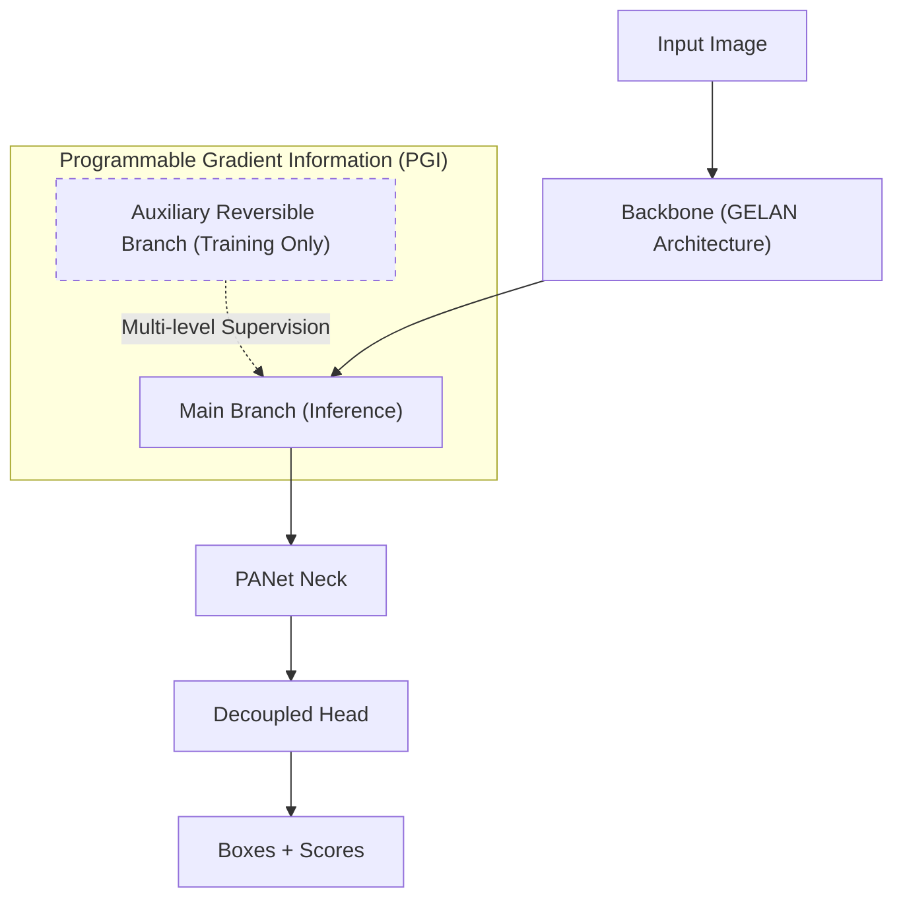
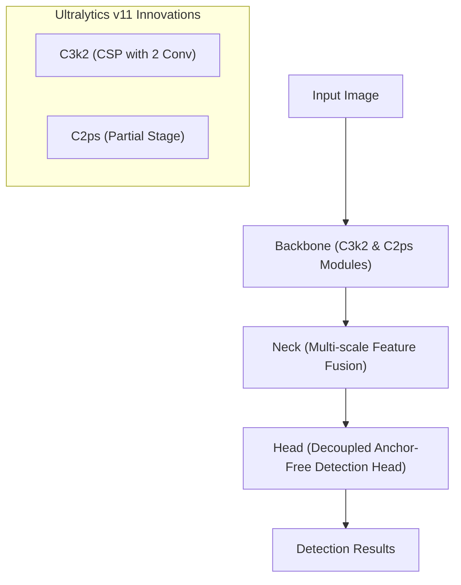
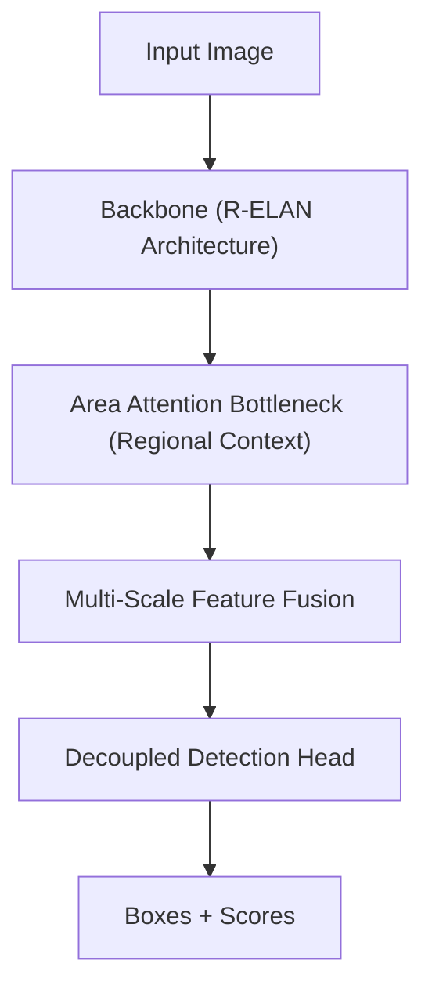
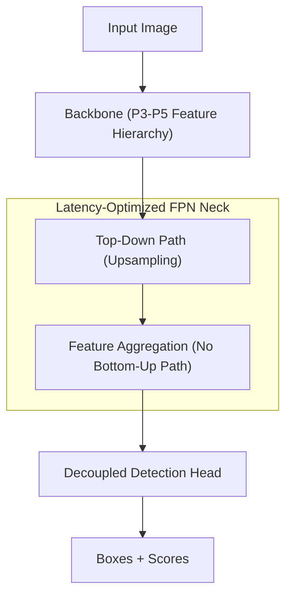
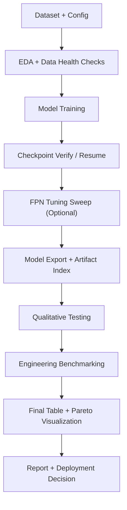
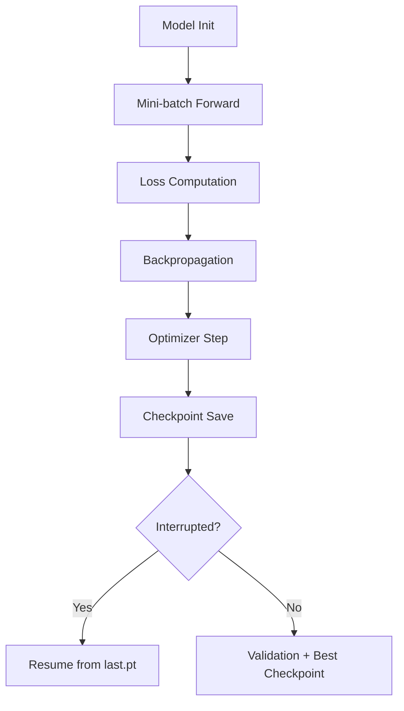
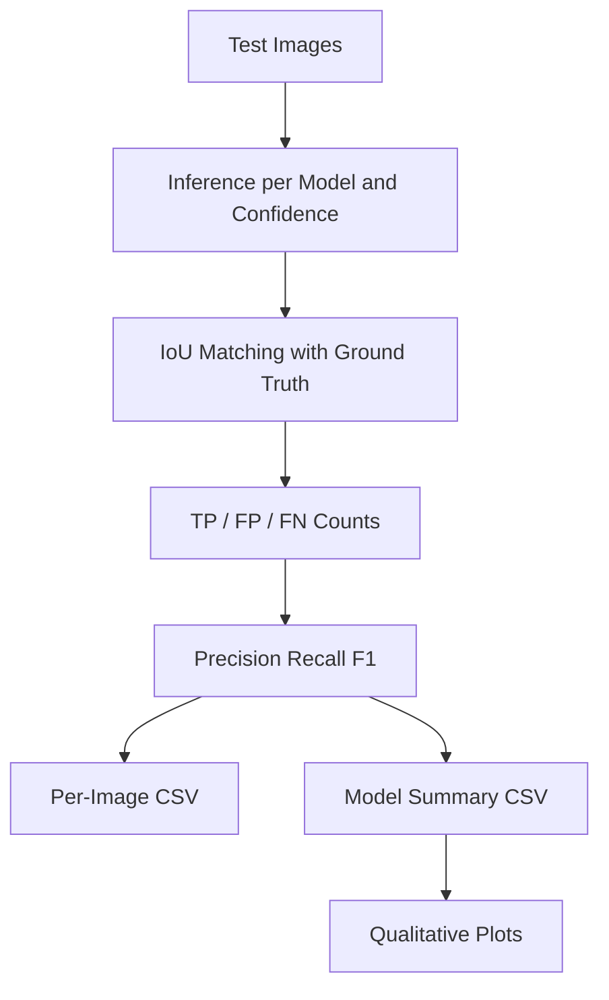
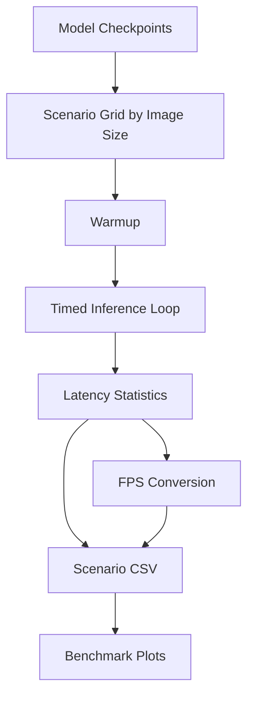

# Technical Methodology: DETECTION AND LOCALIZATION OF POTHOLES ON ROAD USING DRONE IMAGES

Author: EngJamesO

Date: February 17th 2026

## **Executive Summary**

This document outlines the experimental design for benchmarking five distinct object detection architectures—YOLOv8, YOLOv9, YOLOv11, YOLOv12 and YOLO-FPN—for the specific task of detecting road anomalies (potholes) from aerial imagery. The primary objective is not merely maximising precision, but identifying the "Pareto frontier" between inference latency (ms) and detection accuracy (mAP), typically suitable for deployment on embedded edge devices (e.g., NVIDIA Jetson Orin NX) aboard UAVs. This report documents the methodology, workflow, and results for a pothole detection benchmark using drone-relevant road imagery and YOLO-family detectors.

Primary objective:

- Identify the best accuracy-latency trade-off for deployment in near-real-time infrastructure inspection.

Model scope:

- `YOLOv8n`
- `YOLOv9c`
- `YOLOv11`
- `YOLOv12n`
- `YOLOv8-FPN`

## **3. Methodology**

### **3.1 Problem framing**

The task is single-class object detection (`pothole`) using aerial/road images. The operational requirement is not only high mAP, but high mAP under latency constraints for practical edge/cloud inference.

### **3.2 Dataset composition**

We utilise a comprehensive single-source dataset to ensure model robustness. The training set focuses on learning high-level features, while the validation set tests generalisation during training, and the test set acts as the final out-of-sample holdout.

| Dataset Source | Role | Size (Images) | Key Characteristics | Selection Rationale |
| :---- | :---- | :---- | :---- | :---- |
| Smartathon (Roboflow) | Training | \~6,091 | High Resolution Nadir & Oblique angles  Varied lighting (shadows) | The "top-down" perspective closely mimics the orthomosaic imagery generated by drone mapping missions. |
| Smartathon (Roboflow) | Validation | \~2,094 | Same source characteristics | Acts as an ongoing validation test during training to ensure the model isn't overfitting. |
| Smartathon (Roboflow) | Testing | \~1,055 | Same source characteristics | Held-out test split for final evaluation and qualitative comparison tests. |

Primary Data: Smartathon New Pothole Detection (Roboflow). Total Volume: \~9,240 images  
Rationale: This dataset offers high-resolution imagery with a mix of viewing angles. Crucially, it contains a subset of "top-down" (nadir) or high-angle oblique shots, which more closely resemble drone orthomosaics than standard automotive dashcam datasets.

Validation is implemented directly in the notebook pipeline at two levels: (1) `data.yaml` is explicitly patched to point `val` to the dataset's internal `valid/images` split, and (2) each trained model is evaluated using `model.val(..., split='val')` before its metrics are stored in the final benchmark table.

### **3.3 Exploratory Data Analysis**

Before model training, EDA was used as a formal data quality gate rather than a visualisation-only step. The notebook computes split-level health statistics (images, label files, missing labels, empty annotations), geometric statistics (box width, height, area, aspect ratio), and spatial centre-density patterns. This establishes whether the dataset is balanced enough for fair architecture comparison and identifies small-object prevalence, which is central for pothole detection from UAV altitude.

From notebook EDA outputs:

- Total annotations analysed: `22,603`
- Training images: `6,091` (annotated: `6,087`)
- Validation images: `2,094`
- Test images: `1,055`
- Average boxes/image: approximately `2.5` across all splits.

Bounding-box summary:

- Mean normalised width: `0.228`
- Mean normalised height: `0.157`
- Mean normalised area: `0.0609`
- Median normalised area: `0.0161`


This plot captures the label geometry distribution. The key takeaway is the long-tail area profile: the dataset has many small to medium potholes and fewer very large ones, which motivates using architectures and augmentations that preserve small-object sensitivity.


This figure highlights variation across annotation geometry and split behavior. The spread supports the decision to benchmark multiple architectures rather than optimize a single model early.

The area-vs-aspect-ratio scatter (split-colored) shows heterogeneous object geometry across train/valid/test splits, including compact near-circular potholes and elongated irregular defects. Because detection heads and feature aggregation strategies react differently to this geometric diversity, benchmarking only one architecture could overfit conclusions to a narrow object profile; evaluating multiple architectures improves confidence that performance trends are robust across morphology regimes.


The qualitative sample overlays confirm annotation quality and variability in road texture, lighting, and pothole shape. This supports the later use of confidence-threshold sweeps in evaluation.

### **3.4 Pre-processing Strategy**

Notebook-aligned preprocessing/training settings are:

1. Resolution standardisation: `imgsz=640` is fixed for baseline training/evaluation and for baseline engineering reporting.
2. Validation split usage: evaluation is explicitly run on the `val` split (`split='val'`) after training.
3. YOLO default augmentations for baseline runs include mosaic-enabled training behavior.
4. Additional augmentation sweeps are applied in the dedicated FPN tuning cell (e.g., `mosaic`, `mixup`, `hsv_*`, `degrees`, `translate`, `scale`, and `close_mosaic`) to test recovery of FPN accuracy without changing deployment resolution.

### **3.5 Dataset and annotation format**

The training pipeline uses YOLO-format datasets with split directories:

- `train/images`, `train/labels`
- `valid/images`, `valid/labels`
- `test/images`, `test/labels`

YOLO label row schema:

- `class_id x_center y_center width height`
- all coordinates are normalized to `[0, 1]` relative to image width/height.

Example label row captured from parsed dataset labels during EDA:

- `0 0.512500 0.638889 0.123438 0.086111`

Interpretation: class `0` (`pothole`) is centered at `(51.25%, 63.89%)` of image width/height, with width `12.34%` and height `8.61%` of the image.

### **3.7 Model Architectures & Selection Rationale**

Among the top pothole detection architectures, the following commonly appear: YOLO and YOLO-FPN. We selected five architectures to represent the evolution of the YOLO family of computer vision models, specifically targeting the trade-off between architectural complexity and speed.

1. `YOLOv8n`: baseline compact detector with strong speed/accuracy balance.
2. `YOLOv9c`: larger model variant with stronger representational capacity; expected mAP gains with latency cost.
3. `YOLOv11`: efficient modern YOLO variant targeting practical deployment speed.
4. `YOLOv12n`: newer compact model expected to preserve accuracy with moderate inference cost.
5. `YOLOv8-FPN`: custom neck simplification favouring speed over localisation quality.

#### YOLOv8 (Baseline)

YOLOv8 introduced the C2f (Cross Stage Partial bottleneck with two convolutions) module, replacing the older C3 module. It utilises an anchor-free detection head, which decouples the classification and regression tasks.

It serves as the control variable. Any improvements in v9 or v12 must be statistically significant against this baseline to justify the added complexity.

```mermaid
flowchart TD
    I[Input Image] --> B["Backbone (CSPDarknet P1-P5)"]
    
    subgraph Backbone_Structure ["Backbone Details"]
        direction TB
        Stem["Initial Conv"] --> C2f_1["C2f Blocks (Feature Extraction)"]
        C2f_1 --> SPPF["SPPF (Spatial Pyramid Pooling Fast)"]
    end

    subgraph Neck_Structure ["Neck (PAN-FPN)"]
        direction TB
        TD["Top-Down Path (Semantic Enrichment)"]
        BU["Bottom-Up Path (Localization Enhancement)"]
        TD <-> BU
    end

    subgraph Head_Structure ["Decoupled Head"]
        direction TB
        Cls["Classification Branch (BCE Loss)"]
        Reg["Regression Branch (dfL/CIoU Loss)"]
    end

    B --> TD
    TD --> BU
    BU --> Head_Structure
    Head_Structure --> O[Boxes + Scores]
```

#### YOLOv9 (Programmable Gradient Information)

Deep neural networks often suffer from the "Information Bottleneck" problem, where feature data is lost as it passes through successive downsampling layers.

Innovation: YOLOv9 introduces Programmable Gradient Information (PGI) and the Generalised Efficient Layer Aggregation Network (GELAN). PGI provides an auxiliary supervision branch that ensures gradients reliably propagate back to shallow layers.

Potholes are small, texture-poor objects. By preventing information loss in deep layers, v9 should theoretically maintain higher recall for small defects that v8 might compress away.



#### YOLOv11

YOLOv11 is included as an efficiency-focused modern detector in the Ultralytics family, targeted at improving speed-accuracy balance on lightweight deployments. Relative to heavier variants, it keeps a compact parameter budget while preserving competitive detection quality.

For pothole detection, YOLOv11 is a practical candidate when latency is more important than peak mAP. In this benchmark, it is expected to stay above real-time FPS constraints while maintaining stronger quality than aggressively simplified neck variants.



#### YOLOv12 (Attention-centric)

Released in early 2025, YOLOv12 shifts away from pure CNNs to an Attention-Centric design without the extreme computational cost of Transformers. It uses Area Attention, which divides feature maps into regions to capture global context, and R-ELAN for the backbone.

It is considered because potholes are often confused with shadows, oil stains, or patches. Convolutional networks focus on local features (edges), whereas attention mechanisms focus on context. v12 should be superior at reducing False Positives (e.g., classifying a shadow as a pothole).



#### YOLO-FPN (Latency Optimisation)**

Standard YOLOv8 uses PANet (Path Aggregation Network), which has both a top-down path (semantics) and a bottom-up path (localisation). We modify the architecture by replacing the standard Path Aggregation Network (PANet) neck with a classic FPN (Feature Pyramid Network), effectively removing the extra bottom-up path.

PANet adds a "bottom-up" path to augment localisation features, but this adds significant computational cost (FLOPs). By reverting to a simpler FPN, we hypothesise a 15-20% gain in inference speed with only a marginal drop in localisation accuracy.

Expected practical effects of this modification include:

- Fewer feature aggregation operations compared with heavier bi-directional necks.
- Lower computational load (FLOPs proxy), improving latency and FPS.
- Slightly weaker fine localisation/feature re-aggregation, which can reduce detection quality on hard cases.

Trade-off expected from design:

- Speed gains, especially on constrained hardware.
- Potential drop in `mAP50-95` due to less expressive feature fusion.

Conceptually:

1. Backbone extracts hierarchical features (`P3`, `P4`, `P5`).
2. FPN top-down path upsamples high-level semantics and merges with lower-level maps.
3. Detection head predicts boxes/classes from fused multi-scale features.



#### Model Comparison Matrix

| Model | Core Innovation | Backbone / Neck | Hypothesis for Pothole Detection |
| :---- | :---- | :---- | :---- |
| **YOLOv8** | Anchor-Free / C2f | CSPDarknet / PANet | **The Baseline.** Provides the standard performance benchmark for speed vs. accuracy. |
| **YOLOv9** | PGI & GELAN | GELAN / PANet \+ PGI | **Small Object Specialist.** PGI retains gradient info lost in deep layers, critical for small potholes. |
| **YOLOv11** | Efficient lightweight redesign | Ultralytics v11 Backbone / Multi-scale Neck | **Efficiency contender.** Targets strong runtime efficiency while preserving practical pothole recall. |
| **YOLOv12** | Area Attention | R-ELAN / Attention | **Texture discriminator.** Attention mechanisms should better distinguish wet spots from potholes. |
| **YOLO-FPN** | Neck Simplification | CSPDarknet / **FPN** | **Speed Specialist.** Removing the bottom-up PANet path reduces FLOPs for higher flight speeds. |

### **3.8 ML Workflow**

The workflow is structured as a reproducible experiment pipeline: each stage produces explicit artefacts (checkpoints, CSV summaries, figures, exported models) that feed the next stage. This prevents hidden evaluation drift and makes it possible to re-run only failed/interrupted stages without invalidating final comparisons.

1. Environment setup and dataset loading.
2. EDA and dataset integrity checks.
3. Ultralytics model training (checkpoint-aware resume).
4. Training status verification from run artefacts.
5. Optional FPN-only fine-tuning sweep.
6. Artefact export (`.pt`, `.onnx`, `.yaml`) and index generation.
7. Qualitative testing over confidence thresholds.
8. Engineering benchmarking across image-size scenarios.
9. Final visualisation, ranking, and report export.



#### Model Training workflow

1. Initialise model weights/config (`.pt` pretrained or custom YAML build).
2. Train on YOLO-format splits with fixed `imgsz=640` and configured batch size.
3. Apply data augmentation (mosaic/mixup/scale/translation) from training config.
4. Save checkpoints per run (`last.pt`, `best.pt`, `results.csv`).
5. Resume interrupted runs from `last.pt` using checkpoint-aware logic.
6. Validate on `val` split and store mAP metrics.



#### Optimisation objective and loss composition

Object detection training optimises a composite loss:
$$
\mathcal{L}_{total} = \lambda_{box}\mathcal{L}_{box} + \lambda_{cls}\mathcal{L}_{cls} + \lambda_{dfl}\mathcal{L}_{dfl}
$$
where:

- $(\mathcal{L}_{box})$: box regression loss (localization quality)
- $(\mathcal{L}_{cls})$: classification loss
- $(\mathcal{L}_{dfl})$: distribution focal loss term used in modern YOLO heads
- $(\lambda)$ terms: weighting coefficients

Parameter update step:
$$
\theta_{t+1} = \theta_t - \eta \nabla_{\theta} \mathcal{L}_{total}
$$
with learning rate $(\eta)$ and optimizer-defined update dynamics.

### **3.9 Evaluation metrics**

For evaluation, we combine engineering constraints such as FLOPs with traditional academic metrics.

1. mAP @ 50-95: The standard for bounding box precision.  
2. Inference Latency (ms)  
3. FLOPs (Floating Point Operations): A proxy for power consumption. Higher FLOPs \= higher GPU wattage \= reduced flight time.  
4. Recall (False Negative Rate): In self driving behicles applications, missing a pothole (False Negative) is worse than flagging a shadow as a pothole (False Positive), as the latter can be filtered by human review.

| Metric | Unit | Definition & Relevance |
| :---- | :---- | :---- |
| **mAP @ 50-95** | % | **Mean Average Precision.** The standard academic measure of detection quality averaged over IoU thresholds from 0.5 to 0.95. |
| **Inference Latency** | ms | **Time-to-Action.** The time elapsed between inputting an image tensor and receiving bounding box coordinates. Critical for real-time flight control. |
| **Throughput** | FPS | **Frames Per Second.** 1000 / Latency. A minimum of 30 FPS is required to ensure overlap redundancy in aerial mapping. |
| **FLOPs** | G | **Floating Point Operations.** A proxy for computational complexity and battery drain on the drone. |
| **Small Object Recall** | % | Specific recall metric for bounding boxes smaller than 32x32 pixels (COCO definition). This is the true test for high-altitude pothole detection. |

#### Detection quality metrics

IoU (Intersection over Union):
$$
IoU = \frac{|B_{pred} \cap B_{gt}|}{|B_{pred} \cup B_{gt}|}
$$

Precision:
$$
Precision = \frac{TP}{TP + FP}
$$
Precision indicates how many predicted potholes are truly potholes. High precision reduces false alarms.

Recall:
$$
Recall = \frac{TP}{TP + FN}
$$
Recall indicates how many actual potholes are detected. In road safety workflows, recall is critical because false negatives (missed potholes) are operationally costly.

F1-score:
$$
F1 = \frac{2 \cdot Precision \cdot Recall}{Precision + Recall}
$$
F1 balances precision and recall when both matter.

mAP metrics:

- `mAP50`: AP at IoU threshold `0.50`.
- `mAP50-95`: AP averaged from IoU `0.50` to `0.95` (stricter localisation quality indicator).

#### Runtime metrics

Frame rate:
$$
FPS = \frac{1000}{Latency_{ms}}
$$

Latency summary statistics used in benchmarking:

- `mean`: average latency across runs.
- `p50`: median latency (typical-case runtime).
- `p95`: 95th percentile latency (near worst-case runtime).
- `std`: standard deviation of latency (jitter/stability).

Interpretation of key runtime values:

- Low `mean` with high `p95` suggests occasional spikes.
- Low `std` indicates stable inference timing.
- For real-time systems, `p95` is usually more actionable than mean alone.

## **4. Results and Discussion**

The evaluation phase is divided into:

1. Pareto
2. Qualitative testing
3. Benchmarking

### 4.1 Model comparison table

The table below is compiled by merging model-level validation metrics (`mAP50`, `mAP50-95`, parameters) from post-training `val` runs with engineering benchmark outputs (`Latency_ms`, `FPS`) measured at baseline `imgsz=640`. This creates a single decision matrix where academic detection quality and deployment runtime constraints are evaluated together.

| Model | mAP50 | mAP50-95 | Parameters (M) | Latency (ms) | FPS |
| --- | ---: | ---: | ---: | ---: | ---: |
| YOLOv8n | 0.7821 | 0.4649 | 3.0058 | 6.9098 | 144.72 |
| YOLOv9c | **0.7921** | **0.4846** | 25.3200 | 36.2758 | 27.57 |
| YOLOv11 | 0.7789 | 0.4596 | 2.5823 | 9.3494 | 106.96 |
| YOLOv12n | 0.7848 | 0.4631 | 2.5569 | 13.8610 | 72.14 |
| YOLOv8-FPN | 0.7066 | 0.3960 | **2.2058** | **6.4183** | 155.80 |

Key outcomes:

- Best accuracy: `YOLOv9c`
- Fastest inference: `YOLOv8-FPN`
- Best real-time quality compromise in this run: `YOLOv12n`

### 4.2 Final Pareto figure


This chart shows the central trade-off: YOLOv9c dominates in accuracy but sits outside a strict 30 FPS constraint, while YOLOv8-FPN dominates speed but with a clear accuracy penalty. YOLOv12n and YOLOv8n are on a more practical deployment boundary for real-time use. The plotting code was updated to (i) use higher-contrast model colours, (ii) force axes to start at `(0,0)`, (iii) improve legend spacing outside the plot, and (iv) place the red real-time cutoff at `33.33 ms` (equivalent to `30 FPS`).

### 4.3 Qualitative Testing

#### 4.3.1 Qualitative Testing Workflow

1. Sample test images from the held-out split.
2. Run inference for each model at confidence thresholds (`0.25`, `0.50`, `0.70`).
3. Convert predictions and labels to a comparable box format.
4. Perform IoU-based greedy matching to compute `TP`, `FP`, and `FN`.
5. Aggregate per-image and per-model metrics (`Precision`, `Recall`, `F1`).
6. Export per-image and summary CSV files.
7. Plot confidence/model comparison and distribution views.



For each image and model-threshold pair:

- boxes are matched when `IoU >= 0.5`
- Unmatched prediction boxes contribute to `FP`
- unmatched ground-truth boxes contribute to `FN`

Using:
$$
Precision = \frac{TP}{TP + FP},\quad
Recall = \frac{TP}{TP + FN},\quad
F1 = \frac{2PR}{P+R}
$$

#### 4.3.2 Qualitative Testing Result Interpretation

- At `conf=0.25`, `YOLOv11` achieved the best F1 balance.
- At higher confidence thresholds (`0.50`, `0.70`), `YOLOv9c` remained strongest.
- `YOLOv8-FPN` stayed speed-favoured but trailed in F1.


This bar plot compares mean F1 across confidence levels. It shows confidence sensitivity by architecture and highlights where each model performs best. YOLOv11 peaks at lower confidence, while YOLOv9c retains stronger F1 as thresholds increase, making v9c more robust for stricter confidence filtering.


The heatmap makes model-threshold interactions easier to compare. It is useful for selecting operating thresholds for deployment profiles. The best-performing operating zone is concentrated around YOLOv9c/YOLOv11 at moderate confidence, whereas YOLOv8-FPN remains consistently lower across threshold choices.


Distribution spread reveals stability: narrower, higher distributions are preferable for consistent field performance rather than isolated high scores. Architectures with tighter high-F1 distributions are operationally safer because they reduce frame-to-frame quality volatility on diverse road scenes.


This qualitative panel provides direct visual confidence in detection behaviour and failure modes, complementing numeric metrics. Visual overlays confirm that top-ranked models generally localise major potholes reliably, with residual errors concentrated around ambiguous textures and low-contrast boundaries.

### 4.4 Engineering Benchmarking

#### 4.4.1 Engineering Benchmarking Workflow

1. Load each trained checkpoint.
2. Define scenario set by image size (`320`, `640`, `960`).
3. Run warmup passes to stabilise runtime.
4. Run timed inference loops (`runs=80`) per scenario.
5. Compute `mean`, `p50`, `p95`, `std`, and `FPS`.
6. Export scenario and aggregated benchmark CSVs.
7. Produce trend, heatmap, and baseline p95 plots.



Primary runtime transformation:
$$
FPS = \frac{1000}{Latency_{ms,mean}}
$$

`p95` latency is emphasised for deployment because mean latency alone can hide jitter. Lower `p95` and lower `std` generally indicate a more stable runtime profile.

At `imgsz=640`:

- YOLOv8n: `6.91 ms`, `144.72 FPS`
- YOLOv9c: `36.28 ms`, `27.57 FPS`
- YOLOv11: `9.35 ms`, `106.96 FPS`
- YOLOv12n: `13.86 ms`, `72.14 FPS`
- YOLOv8-FPN: `6.42 ms`, `155.80 FPS`

#### 4.4.2 Engineering Benchmarking Results Interpretation


This trend chart shows scale sensitivity. As image size increases, latency rises non-linearly depending on architecture complexity. YOLOv9c exhibits the steepest latency growth with resolution, confirming that its higher-capacity design is the main barrier to strict edge real-time deployment.


This chart translates latency into deployment-friendly throughput and directly shows which models remain above the 30 FPS requirement. The lightweight models sustain an FPS buffer above 30 at baseline settings, while heavy models approach or fall below the operational threshold as input size increases.


The heatmap gives a compact scenario-level comparison and makes cross-model runtime ranking immediate. The model ranking is stable across scenarios, indicating that relative runtime behaviour is structural (architecture-driven) rather than noise from a single test condition. It is also worthy of note that the latency of the YOLOv9c model rapidly increases as the image size increases. This is primarily attributed to the significantly higher parameter count and architectural complexity of the YOLOv9c (25.3M parameters) compared to the 'nano' variants (approx. 2.5–3M parameters). The quadratic increase in computational complexity relative to input resolution (O(W*H)) has a much more pronounced absolute impact on the deeper GELAN blocks and PGI auxiliary branches, leading to the steeper latency penalty observed on edge hardware.


The p95 chart highlights worst-case behaviour at baseline settings, which is critical for real-time reliability. The models with low mean latency but elevated p95 tails are less predictable in deployment; lower p95 spread is preferred for mission safety.

### **4.5 Deployment**

The deployment phase validates the trained model's utility in a centralised web-based API for real-time processing.

The best-performing model (selected based on the mAP/Latency Pareto frontier) is deployed as a RESTful microservice. We utilise Render for containerised hosting due to its native support for Docker and consistent runtime environments, which surpass the serverless function size limits often encountered on platforms like Vercel.

### 4.5.1 System Architecture

Inference Engine: To minimise the memory footprint, the trained PyTorch weights (.pt) are exported to ONNX (Open Neural Network Exchange) format. We utilise ONNX Runtime (CPU build) for the inference backend, reducing the slug size by \~60% compared to a full PyTorch installation.

The API Framework is a FastAPI application that serves as the interface, exposing a POST /predict endpoint. The application is packaged via Docker into a container. The Dockerfile utilises a slim Python 3.10 base image, installs system dependencies (libgl1), and exposes port 8000.

Workflow:

1. Client sends a base64 encoded image or binary file.  
2. Server pre-processes the image (resize to 640x640, normalisation).  
3. ONNX Runtime executes the session.  
4. Post-processing (Non-Maximum Suppression) filters bounding boxes.  
5. Server returns a JSON object containing class IDs, confidence scores, and bounding box coordinates, alongside the annotated image.

### Current Deployment

For deployment in a real-time or near-real-time application:

- Primary candidate: `YOLOv12n`
- Secondary fallback: `YOLOv8n`
- High-accuracy offline option: `YOLOv9c`

## 5. Conclusion and Recommendations

Across accuracy and runtime objectives, the benchmark confirms no single universal winner: YOLOv9c leads raw detection quality, YOLOv8-FPN leads speed, and YOLOv12n offers the strongest practical balance under real-time constraints. For immediate deployment, YOLOv12n is recommended as the primary model with YOLOv8n as a conservative fallback when runtime headroom is prioritised. For further research, the next phase should include

1. targeted tuning of YOLOv8-FPN to recover localisation quality,
2. controlled threshold calibration under field video streams, and
3. expanded experimentation with YOLO-NAS variants (e.g., YOLO-NAS-S/M) to test whether NAS-designed blocks can improve the current latency-accuracy frontier on pothole-specific data.

`YOLOv9c`:

- Best detector quality in this run.
- Latency too high for a strict real-time edge budget at 640.

`YOLOv12n`:

- Best practical compromise for real-time operation among high-accuracy models.

`YOLOv8n` / `YOLOv11`:

- Strong, balanced candidates with high throughput.

`YOLOv8-FPN`:

- Confirmed speed gain, but mAP drop is significant.
- Requires additional tuning if selected for production.
